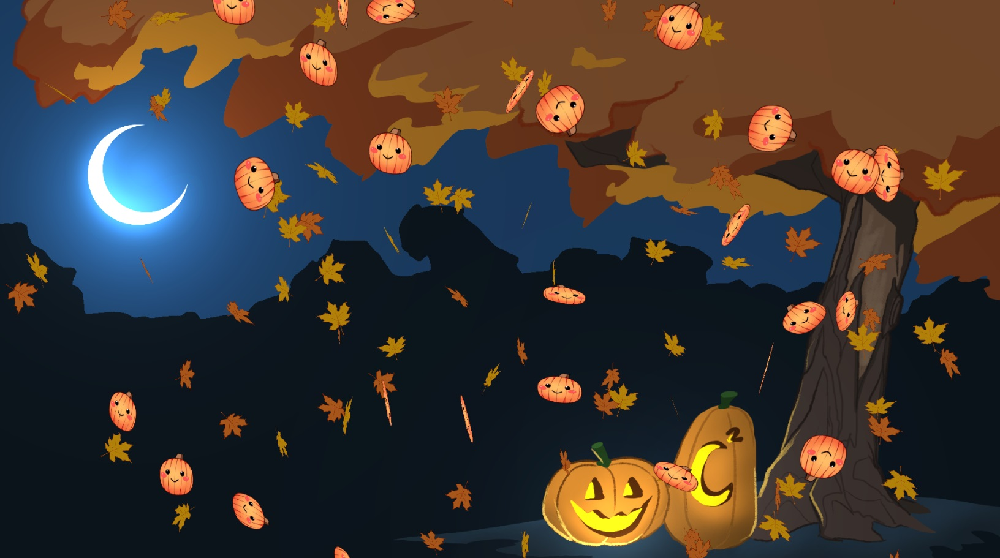

<p align="center">
    
    <br>
    <i>moon2CUTE</i>
</p>

# pixijs-intro-example (falling leaves 🍂)

URL: https://onetrickwolf.github.io/pixijs-intro-falling-leaves/ (optimized for desktop Chrome 75+ for now, some issues on Firefox and mobile)

This is my first attempt at an intro stream for a Twitch stream largely made to test [gif-to-webm-please](https://github.com/onetrickwolf/gif-to-webm-please) 
out.

Currently allows 2 emotes max per message and supports all Twitch and BTTV emotes.

`debug` can be set as a query parameter to show performance stats and `channel=twitch_username` can be set to 
override the default channel (currently https://www.twitch.tv/moonmoon).

Example: https://onetrickwolf.github.io/pixijs-intro-example/?debug&channel=onetrickwolf

## Motivation

Trying to set up a pipeline for Twitch emote integration with PixiJS as I would like to use PixiJS as a game engine 
for Twitch game jams. I previously [made a game jam game for MoonJam 2021](https://github.com/onetrickwolf/moonjam-2021-onetrickwolf) 
but could not support animated emotes or emotes from BTTV. Also the existing solutions used by existing [moonmoon intro 
screens](https://github.com/moonscreens/) and [twitch-chat-emotes](https://www.npmjs.com/package/twitch-chat-emotes) had some issues for PixiJS.

Also was just interested in learning how to do this as well as am genuinely interested in creating some stream intros or integrations!

## External Dependencies

Uses `https://gif-emotes.opl.io/` from [twitch-chat-emotes](https://github.com/CalebBabin/twitch-chat-emotes) to 
grab BTTV JSON.

Uses a deployed AWS Lambda of [gif-to-webm-please](https://github.com/onetrickwolf/gif-to-webm-please) to convert 
animated emotes.

catJAM Example: 
```
https://y6ev4yhjw1.execute-api.us-east-1.amazonaws.com/dev?gif=https://cdn.betterttv.net/emote/5f1b0186cf6d2144653d2970/2x
```

## Roadmap

- Make some more interesting intro screens now that I have the basics down
- Eventually turn temporary lambda into more of a real API with a real domain.
- Add more configurations:
  - Change or remove background
  - Adjust amount of leaves or leaf images
  - Add some debugging controls
  - Number of emotes allowed
  - Special configs based on subscriber status similar to `twitch-chat-emotes`
- Would like to eventually implemented this with [FFmpeg WASM](https://github.com/ffmpegwasm/ffmpeg.wasm) as well so
  conversion can be done completely in browser. FFmpeh WASM only works with Chromium 79 and above though and OBS is
  currently still on Chromium 75.
- Potentially make common library or contribute to `twitch-chat-emotes`
- Performance tweaks, currently GSAP as a Tween engine seems to be the cause of performance issues not sure why...

## Known Issues

- In Chrome and some other browsers the animated emotes will not play unless you interact with the screen first (just clicking anywhere is enough). If the animated emotes are frozen you'll need to refresh and click somewhere before the emotes start to appear. This is not an issue in OBS but I will probably add something that forces users to interact first if a non-OBS browser is detected. FYI this is an intentional feature of browsers to prevent autoplaying videos, there's not really anything I can do to fix it other than adding forced interaction.
- In Firefox video textures will flicker, this seems to be an issue with pixi not sure if I will patch this since the intended target is OBS Chrome: https://github.com/pixijs/pixijs/issues/4089

## More Resources

If you'd like to make a stream intro (especially a 3D one) I'd highly recommend [moonmoon intro screens](https://github.com/moonscreens/) and [twitch-chat-emotes](https://www.npmjs.com/package/twitch-chat-emotes).

I'll be continuing to develop these methods and standardize them but I don't consider this example quite as 
developed or stable as the existing stream intros.

### Credits

- Tweening taken from or inspired by [this falling leaf animation](https://codepen.io/MAW/pen/KdmwMb) but 
  modified to work 
  for PixiJS with pixi-projection
- Much of the parsing logic taken from or inspired by [twitch-chat-emotes](https://www.npmjs.com/package/twitch-chat-emotes)


